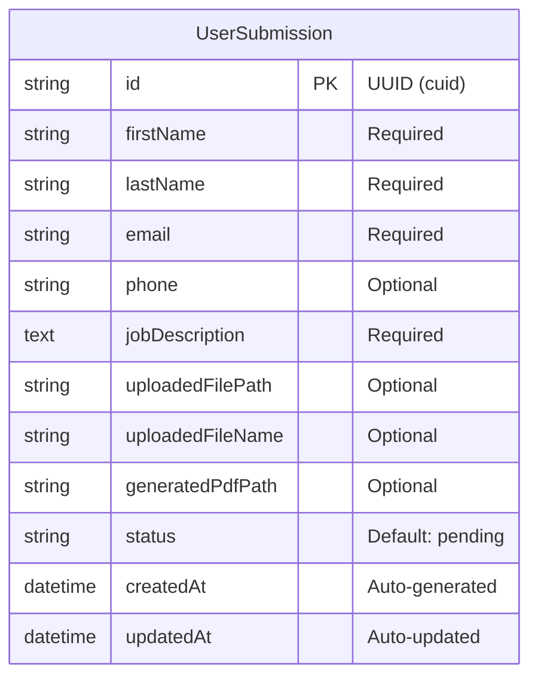

# Data Model Documentation

## Entity Relationship Diagram



## Database Schema Details

### UserSubmission Table

This table stores all job application submissions from users.

| Column           | Type     | Constraints                 | Description                                               |
| ---------------- | -------- | --------------------------- | --------------------------------------------------------- |
| id               | string   | PRIMARY KEY, DEFAULT cuid() | Unique identifier for each submission                     |
| firstName        | string   | NOT NULL                    | Applicant's first name                                    |
| lastName         | string   | NOT NULL                    | Applicant's last name                                     |
| email            | string   | NOT NULL                    | Applicant's email address                                 |
| phone            | string   | NULL                        | Optional phone number                                     |
| jobDescription   | text     | NOT NULL                    | Current job description provided by applicant             |
| uploadedFilePath | string   | NULL                        | Server path to uploaded PDF file                          |
| uploadedFileName | string   | NULL                        | Original name of uploaded file                            |
| generatedPdfPath | string   | NULL                        | Server path to generated PDF                              |
| status           | string   | DEFAULT 'pending'           | Submission status: pending, processing, completed, failed |
| createdAt        | datetime | DEFAULT now()               | Timestamp of submission creation                          |
| updatedAt        | datetime | AUTO UPDATE                 | Timestamp of last update                                  |

## Status Flow

```
pending → processing → completed
                    ↘ failed
```

- **pending**: Initial state when form is submitted
- **processing**: PDF generation in progress
- **completed**: PDF successfully generated
- **failed**: Error occurred during processing

## File Storage Structure

```
/uploads
├── /[timestamp]-[filename].pdf     # Uploaded resumes
└── /generated
    └── application-[submission-id].pdf  # Generated PDFs
```

## Indexes

- Primary Key: `id`
- Indexes for query optimization:
  - `email` (for finding submissions by email)
  - `createdAt` (for sorting by date)
  - `status` (for filtering by status)

## Data Retention

- Submissions are stored indefinitely in development
- In production, implement cleanup policy:
  - Remove uploaded files after 30 days
  - Archive completed submissions after 90 days
  - Delete failed submissions after 7 days
